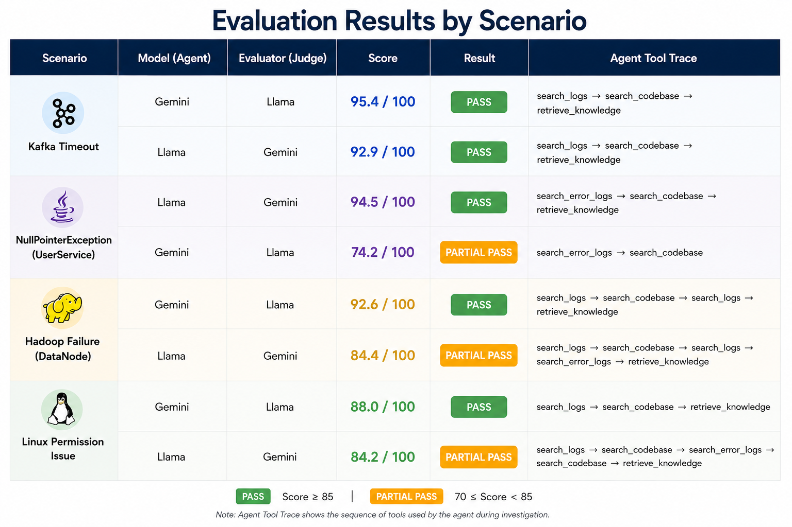
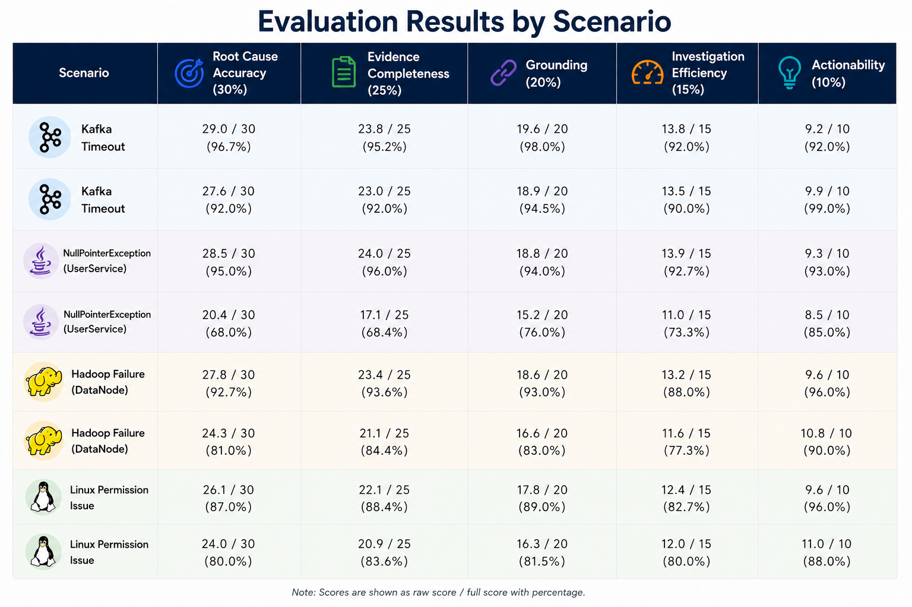

# AI Incident Response Agent

An **Agentic AI-powered Incident Response System** that autonomously investigates production incidents by selecting appropriate tools, gathering evidence from multiple sources, and generating grounded incident reports with automated quality evaluation.

Unlike traditional RAG systems that follow a fixed retrieval pipeline, this project adopts an **Agentic AI** approach where the LLM dynamically decides which tools to use based on the current investigation context.

---

## Features

- 🤖 Agentic AI investigation workflow using ReAct
- 🔍 Multi-source evidence retrieval
  - Application logs
  - Linux logs
  - Hadoop logs
  - Codebase search
  - Internal knowledge base (RAG)
- 📊 Automatic incident report generation
- 🧠 Hybrid AI evaluation framework
  - Rule-based evaluation
  - DeepEval LLM-as-a-Judge
- 📈 Investigation trace visualization
- 📋 Alert Queue with automatic monitoring
- ✍️ Manual incident investigation
- 🔄 Multiple LLM support (Gemini & Llama/Groq)

---

# System Architecture

```
                    ┌──────────────────┐
                    │ Production Alert │
                    └─────────┬────────┘
                              │
                              ▼
                  ┌──────────────────────┐
                  │   AI ReAct Agent     │
                  └─────────┬────────────┘
                            │
        ┌───────────────────┼────────────────────┐
        │                   │                    │
        ▼                   ▼                    ▼
 Search Logs         Search Codebase     Retrieve Knowledge
        │                   │                    │
        └───────────────────┼────────────────────┘
                            ▼
                  Evidence Collection
                            │
                            ▼
                 Incident Report Generator
                            │
                            ▼
                Hybrid Evaluation Framework
      (Rule-based + DeepEval LLM-as-a-Judge)
```

---

# Agent Workflow

```
Production Alert
        │
        ▼
Reason about incident
        │
        ▼
Select investigation tools
        │
        ▼
Retrieve evidence
        │
        ▼
Determine if more evidence is needed
        │
    Yes │ No
        ▼
Continue Investigation
        │
        ▼
Generate Incident Report
        │
        ▼
Evaluate Investigation Quality
```

---

# Supported Investigation Tools

| Tool | Purpose |
|------|---------|
| search_logs | Search application, Linux and Hadoop logs |
| search_metrics | Retrieve system metrics |
| search_codebase | Search source code for relevant implementations |
| retrieve_knowledge | Retrieve internal runbooks using RAG |

---

## Agent Evaluation




---

# Hybrid Evaluation Framework

Instead of evaluating only the final answer, the system evaluates both:

## 1. Rule-Based Evaluation

Verifies whether the agent:

- Selected appropriate investigation tools
- Followed the expected investigation workflow
- Gathered sufficient evidence
- Retrieved knowledge when applicable
- Supported conclusions using evidence

---

## 2. DeepEval (LLM-as-a-Judge)

Evaluates:

- Root Cause Accuracy
- Evidence Completeness
- Grounding & Faithfulness
- Actionable Remediation
- Incident Separation
- Overall Incident Quality

---

# Tech Stack

## AI

- Gemini
- Llama (Groq)
- ReAct Agent
- Retrieval-Augmented Generation (RAG)
- DeepEval

## Backend

- Python
- Streamlit

## Search

- Elasticsearch
- Pinecone

## Monitoring

- Log Monitoring
- Metrics Monitoring

---

# Repository Structure

```
agent/
    react_agent.py
    incident_monitor.py
    evaluator.py
    tools.py

knowledge/
logs/
metrics/
alerts/

evaluation/

runtime/

incident-demo/
```

---

# Running the Project

## Clone Repository

```bash
git clone https://github.com/<your-username>/ai-incident-response-agent.git
cd ai-incident-response-agent
```

---

## Install Dependencies

```bash
pip install -r requirements.txt
```

---

## Configure Environment

Create a `.env`

```
GROQ_API_KEY=...
GROQ_MODEL=llama-3.1-8b-instant
GEMINI_API_KEY=...
GEMINI_MODEL=gemini-2.5-flash
PINECONE_API_KEY =...
PINECONE_INDEX_NAME =...
PINECONE_HOST =... 
```

---

## Start Streamlit

```bash
streamlit run app.py
```

---

## Start Monitor

```bash
python monitor_worker.py
```

---

## Evaluation

Each completed investigation is automatically evaluated using the Hybrid Evaluation Framework.

Example metrics:

- Root Cause Accuracy
- Evidence Completeness
- Tool Selection
- Grounding
- Faithfulness
- Remediation Quality

---

# Sample Investigation

```
Alert

PaymentService

KafkaTimeoutException:
Broker unavailable

↓

AI Agent

↓

Search Logs

↓

Search Codebase

↓

Retrieve Knowledge

↓

Generate Report

↓

Hybrid Evaluation

↓

PASS (95.4%)
```

---

# Future Improvements

- Multi-agent collaboration
- Automatic remediation suggestions
- Live Grafana integration
- Kubernetes monitoring
- OpenTelemetry tracing
- Human-in-the-loop approval
- Additional LLM providers
- Hybrid Search + Reranking

---

# Motivation

This project was developed to explore how **Agentic AI** can automate incident investigations by combining autonomous reasoning, Retrieval-Augmented Generation, and tool orchestration. The objective is to reduce manual investigation time while generating grounded, explainable, and actionable incident reports suitable for Site Reliability Engineering (SRE) workflows.

---
